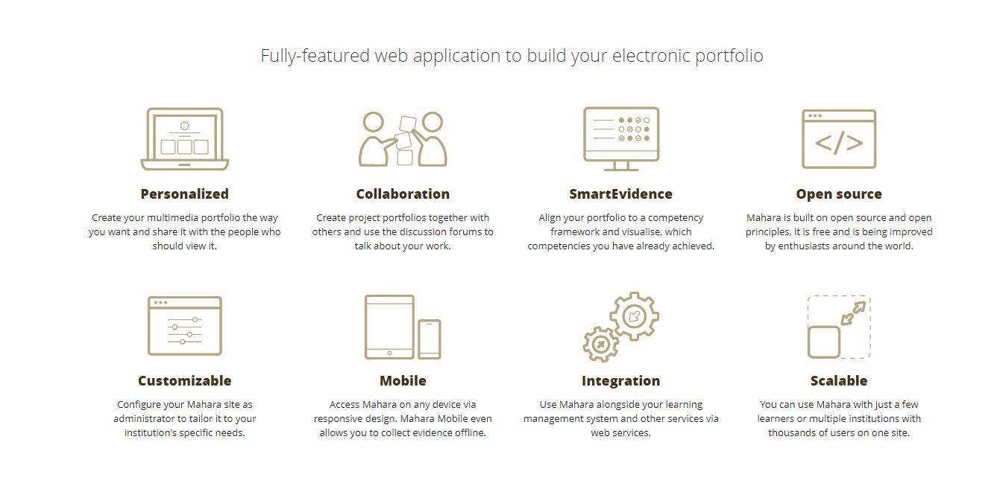
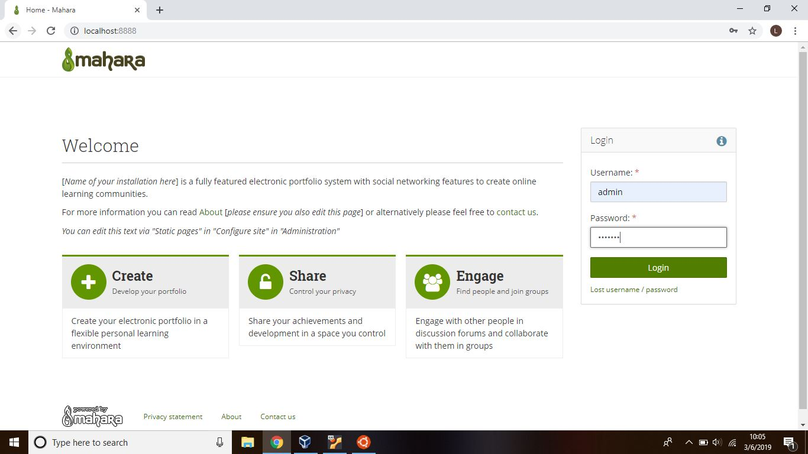
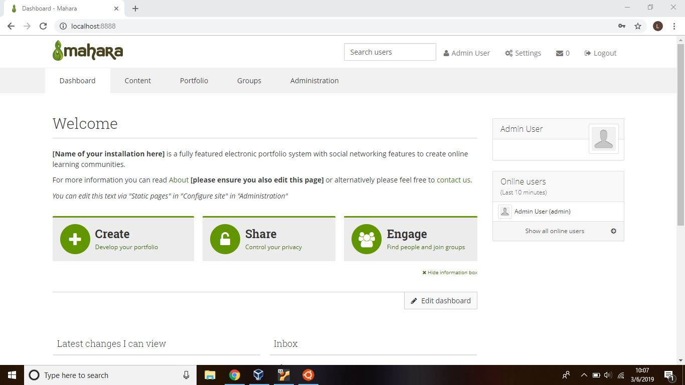

<h1 align="center"></h1>

[Sekilas Tentang Mahara](#sekilas-tentang-mahara) | [Instalasi](#instalasi) | [Konfigurasi](#konfigurasi) | [Upgrade Mahara](#upgrade-mahara) | [Cara Pemakaian](#cara-pemakaian) | [Pembahasan](#pembahasan) | [Referensi](#referensi)
:---:|:---:|:---:|:---:|:---:|:---:|:---:

# **Sekilas Tentang Mahara**
[`^ kembali ke atas ^`](#)

Mahara adalah aplikasi online open-source yang terdiri dari e-portfolio dan jejaring sosial dengan tampilan framework yang fleksibel. Mahara termasuk sebagai aplikasi untuk learning dan course. Mahara dalam bahasa aslinya berarti 'berpikir', Mahara dapat menampilkan dan mengatur e-portfolio dengan lebih mudah dan fleksibel sehingga dapat digunakan untuk pelajar. Mahara memiliki fitur weblog, membangun surat riwayat kerja dan pendidikan dan memiliki sistem jejaring sosial dimana pengguna juga dapat memberikan komen feedback kepada pengguna lain, menghubungkan user dan menciptakan komunitas belajar online.

# **Instalasi**
[`^ kembali ke atas ^`](#)

 1. **Kebutuhan Sistem**
 
	- Server OS: Ubuntu Linux latest LTS
	- Apache web server    
	- PHP (version 5.3.6 atau lebih tinggi lagi)    
	- MySQL(version 5.1 atau lebih tinggi lagi) yang sudah terinstal di Linux VPS
	- Web Browser: latest version of Firefox, Chrome, Safari, Internet Explorer
	- Hardware :
	
		- CPU: Semakin cepat CPU kinerja semakin baik. PHP bergantung pada performa CPU maka semakin cepat CPU waktu respon akan semakin cepat.
		
		- Memory: 256MB pada absolute m 1G atau lebih sangat disarankan.
		
		- Disk: Bergantung kepada kouta disk yang dibutuhkan pengguna. Untuk situs dengan 1000 pengguna, masing-masing 250M kouta, maka membutuhkan 50G untuk memulainya.

2. **Langkah instalasi dalam CLI :**

    - Login ke VPS via SSH

    		ssh mahara@localhost -p 2222
    - Update dan upgrade sistem

    		sudo apt update
    - Install mysql

   			sudo apt-get install -y mysql-server
    - Create database for Mahara
		
			mysql -u root -p
			CREATE DATABASE maharadb character set UTF8;
			GRANT ALL PRIVILEGES ON maharadb.* TO 'maharauser'@'localhost' IDENTIFIED BY 'linux';
			FLUSH PRIVILEGES;
			exit
    - Install Apache2 Web Server

   			sudo apt-get install apache2
    - Install PHP
		
      *Add the PPA*
			
			sudo add-apt-repository ppa:ondrej/php
			
		*Install your PHP Version*
		
			sudo apt-get update
			sudo apt-get install php5.6 libapache2-mod-php5.6 php5.6-mcrypt php5.6-mysql php5.6-gd
	-  Download and Extract Mahara
		
			sudo cd /opt && wget https://launchpad.net/mahara/16.04/16.04.1/+download/mahara-16.04.1.zip
			sudo unzip mahara-16.04.1.zip

		*jika belum ada unzip*
		
			sudo apt install unzip
			sudo mv mahara-16.04.1 /var/www/html/mahara

		*Create Mahara’s upload directory*
		
			sudo mkdir /var/www/html/mahara/upload/
	- Configure Mahara
	
		*Membuat file copy dari config-dist.php yang ada di direktori htdocs, yang diberi nama config.php*
	
			cd /var/www/html/mahara/htdocs/
			sudo cp config-dist.php config.php

		*Masuk ke open config.php dan mengubah beberapa baris.*
	
			sudo nano config.php

			$cfg->dbtype   = 'mysql';
			$cfg->dbhost   = 'localhost';
			$cfg->dbport   = null;
			$cfg->dbname   = 'mahara';
			$cfg->dbuser   = 'maharauser';
			$cfg->dbpass   = 'mahara';
			$cfg->dataroot = '/var/www/html/mahara/upload/';

		*Semua file harus dapat dibaca oleh server, maka harus dibuat akun kepemilikan yang benar*
	
			sudo chown www-data:www-data -R /var/www/html/mahara

	- Configure Apache Web Server
	
		*Membuat virtual host baru di Apache, misal nama virtual hostnya adalah mahara.conf*
		
			sudo touch /etc/apache2/sites-available/mahara.conf
			sudo ln -s /etc/apache2/sites-available/mahara.conf /etc/apache2/sites-enabled/mahara.conf
			sudo nano /etc/apache2/sites-available/mahara.conf
 
		*Kemudian tambahkan baris-baris berikut:*
		
			<VirtualHost *:80>
			ServerAdmin komdat9@gmail.com
			DocumentRoot /var/www/html/mahara/htdocs/
			ServerName localhost:8888
			ServerAlias localhost:8888
			<Directory /var/www/html/mahara/htdocs/>
			Options FollowSymLinks
			AllowOverride All
			Order allow,deny
			allow from all
			</Directory>
			ErrorLog /var/log/apache2/localhost:8888-error_log
			CustomLog /var/log/apache2/localhost:8888-access_log common
			</VirtualHost>

	- Install curl dan xml
	
			sudo apt-get install php5.6-curl -y
			sudo apt-get install php5.6-xml
	- Restart 
	
		*Restart Apache web server*
		
			sudo service apache2 restart
		
	- Buka di browser
	
			http://localhost:8888/htdocs/index.php

# **Konfigurasi**
[`^ kembali ke atas ^`](#)

1. **Batas upload file**

	Post dan upload size maksimal 50M
		 
2. **Plugin**

	Untuk mengecek version number dari plugin yang terinstal dapat dilakukan dengan menjalankan kode dibawah ini pada command line:
		 
		find ./ -iname readme.mahara -exec grep -H 'Version' {} \;
				
	Mahara memiliki banyak sekali plugin yang tersedia, berikut beberapa plugin yang dimiliki oleh Mahara:
	- Plugin Update
		Prosedurnya adalah sebagai berikut:
		
		- Hapus kode plugin(file) lama
			
		- Salin pada kode plugin yang baru
			
		- Pergi ke "Administration".
			
		- Proses Update
	- Plugin thumbnail images untuk konsistensi visual dengan Mahara 1.5 atau yang lebih baru
	- Search Plugins : Sphinx search
	- Blocktype Plugins: CalDAVCalendar, Facebook like/recommend,LinkedIn Profile, dan lain-lain

# **Upgrade Mahara**
[`^ kembali ke atas ^`](#)

Proses adalah sebagai berikut :
1. Tutup site **Mahara**
	
2. Saat dilakukan update, direkomendasikan untuk melakukan maintenance mode sehingga pengguna yang sedang login akan otomatis untuk logout
	
3. Buat backup data dan code yang akan dirubah
	
4. Ganti kode yang lama dengan kode yang baru
	
5. Upgrade database
	- Upgrading pada command-line
	
			sudo -u www-data /usr/bin/php/PATH/TO/YOUR/MAHARA/htdocs/admin/cli/upgrade.php

	- Upgrading a migrated database
	
		Jika database adalah hasil clone/copy, maka user pemilik database baru haruslah menjadi pemilik file cloning lainnya
	
	- Upgrading dari site yang lama kemudian berikan rekomendasi untuk direct upgrade
	
		Terdapat file README.md yang menunjukkan versi minimum dari yang seharusnya diupgrade, dan perhatikan juga apakah versi PHP/SQL yang digunakan kompatibel terhadap mahara versi baru atau tidak. 
6. Open your site

# **Cara Pemakaian**
[`^ kembali ke atas ^`](#)

- Tampilan aplikasi web

	Halaman login 
	
	
	Melakukan pengisian data untuk login

	
	
	Jika login sebagai admin, maka akan masuk ke halaman seperti ini:
	
	
	
	Create and Collect: membuat portfolio baru
	
	Share: Menampilkan portofolio
	
	Engage: Menghubungkan dengan teman dan bergabung dengan grup.
	
- Default Dashboard menampilkan :
    Latest Pages
    My Pages
    Recent Activity
    Topics I’m Following
    
- Content

	Menyimpan semua yang dapat pengguna buat atau unggah untuk digunakan dalam portofolio. Semua informasi dan file yang diberikan di sini pada awalnya hanya dapat dilihat oleh pengguna. Kecuali nama pengguna dan foto profil Anda, keduanya terlihat oleh pengguna online jika diaktifkan. Nama tampilan Anda, tetapi bukan gambar profil Anda, juga terlihat di halaman profil Anda per default.
Konten berisi foto profil, files, journal, resume, plans

- Portofolio

	Portofolio adalah tempat untuk mengumpulkan ‘artefak’ yang telah dikumpulkan pada halaman content. anda dapat memilih untuk membagikannya ke pengguna lain atau menyimpan untuk sendiri.
Menu yang ada di portofolio antara lain pages, page editor, collections, share, export, feedback, feedback or assessment, dan tags.

- Groups

	Group dapat digunakan untuk berkolaborasi sesama user, dapat digunakan untuk diskusi topik, membuat atau mengedit page bersama-sama, berbagi file, berbagi page, dan submit page.
Menu yang terdapat di Groups antara lain mygroups, find groups, my friends, find friends, share page, dan topics.

- Administrasions

- Fungsi-fungsi utama 

	- Dapat melakukan konfigurasi pengaturan bahasa, tema, virus protocol, dan sebagainya.
	- Pemilik akun e-portofolio(mahara) dapat bekerja sama sebagai grup dengan pengguna lain untuk membuat portofolio atau berdiskusi
	- File repository 
		-Membuat folder dan sub folder
		- Mengunggah beberapa files secara cepat dan efisien
		- Memberi nama dan deskripsi pada masing-masing file
		- Mengelola kuota alokasi file 
		- Saat mengunggah suatu file,terdapat persetujuan disclaimer atau spesifik lisensi informasi.
		- Dapat meng-extract .zip, .tar.gz, dan tar.bz2 dari dalam area file.
	- Blogs - membuat blog pribadi
	- Social Networking - untuk membentuk suatu komunitas dan berbagi ePortfolio ke pengguna yang telah mendapat izin.
	- Profile Information - Detail informasi mengenai user berupa nama, alamat, nomor siswa, online messenger, dan foto

# **Pembahasan**
[`^ kembali ke atas ^`](#)

Pendapat anda tentang aplikasi web ini

- pros:
	- Mudah untuk dibagikan ke pengguna lain
	- Dapat menambahkan umpan balik atau feedback ke halaman e-portofolio dan fitur penilaian dengan bintang yang efektif
	- Dapat membuat portofolio yang saling terhubung 
	- Sangat baik untuk portofolio dengan visualisasi yang baik, mahara dapat disematkan berbagai fitur yang dapat diputar di layar misalnya YouTube, SlideShare, GoogleDocs dll
	- Dapat menambahkan teks, gambar, video, suara, URL, dan HTML
- cons:
	- Pengguna tidak dapat menghapus komen feedback yang sudah diberikan
	- Untuk backup data hanya dengan cara mengekspor
	- Tidak ada recycle bin, tidak dapat di undo pekerjaan yang sudah dilakukan
	- Beberapa operasi hanya dapat dilakukan dengan cepat dengan merubahnya langsung lewat database.
	
Bandingkan dengan aplikasi web kelompok lain yang sejenis
- Dengan **Moodle**

	**Moodle** digunakan sebagai tempat untuk memberikan informasi(karena moodle adalah learning management system) sedangkan **mahara** adalah tempat untuk membagikan dan juga sebagai tempat untuk diskusi dimana **mahara** dapat digunakan untuk memberikan feedback secara peer to peer. **Mahara** dapat terintegrasi dengan **moodle**.
	
- Dengan **Canvas**

	**Canvas** mirip dengan **moodle**, **canvas** adalah learning management system dimana **canvas** berbayar dengan free trial selama dua minggu, free unlimited untuk individual, dan berbayar untuk multiple akun. **Mahara** dapat terintegrasi dengan canvas.

# **Referensi**
[`^ kembali ke atas ^`](#)

[Mahara - Open Source ePortfolio dan Jejaring Social](https://www.visigraphic.com/artikel/mahara-open-source-eportfolio-dan-jejaring-social)- Visigraphic

[Instalasi Mahara](https://lms.onnocenter.or.id/wiki/index.php/Instalasi_Mahara) -OnnoCenterWiki

[System Administrator's Guide/Upgrading Mahara](https://wiki.mahara.org/wiki/System_Administrator%27s_Guide/Upgrading_Mahara) -Wiki Mahara

[Plugin](https://wiki.mahara.org/wiki/Plugins) -Wiki Mahara

